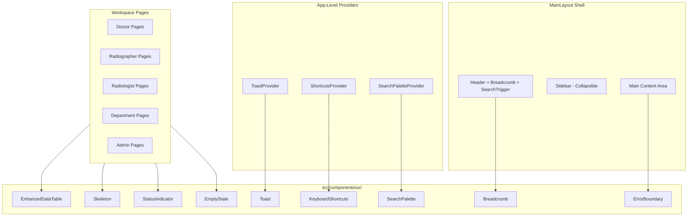
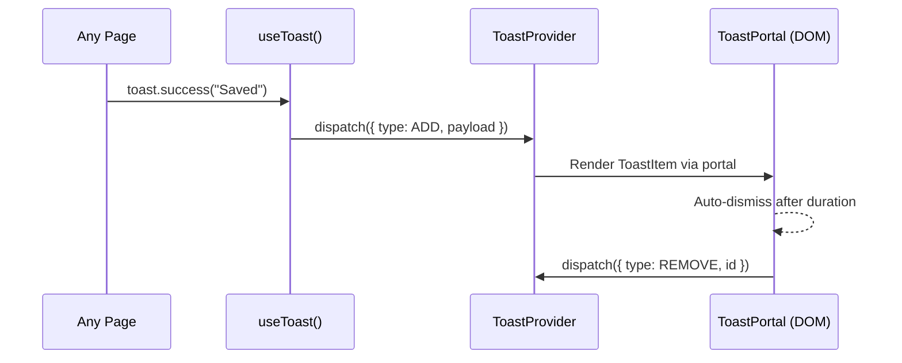
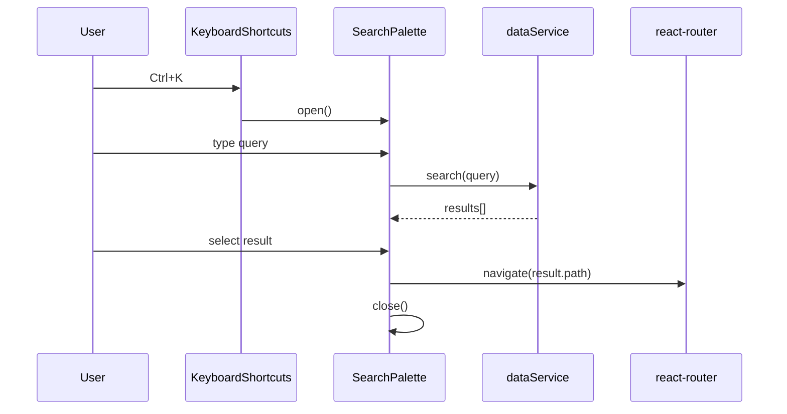
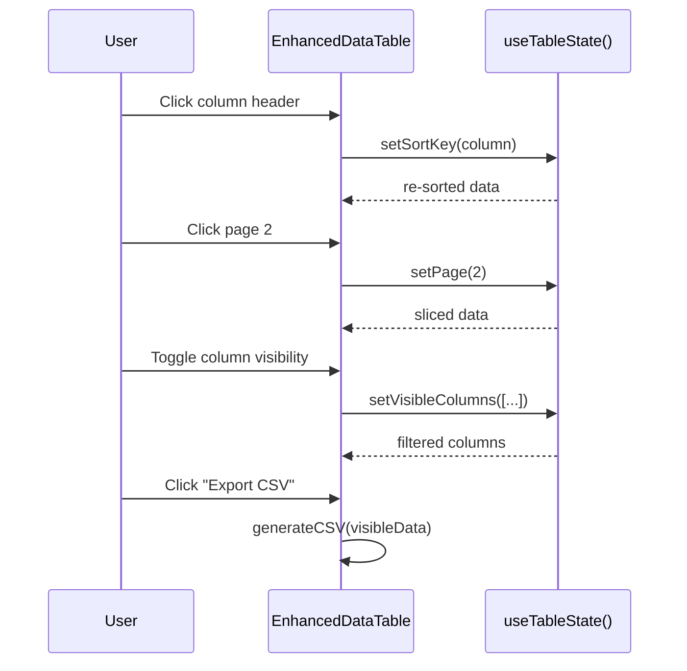

# Design Document: HealthGrid IQ UX Improvements

## Overview

This design establishes a comprehensive UX improvement layer for HealthGrid IQ, a clinical imaging and diagnostic platform built with React 18, Vite, TypeScript, and Tailwind CSS. The improvements introduce reusable primitive components (Toast, Skeleton, SearchPalette, EnhancedDataTable, Breadcrumb, ErrorBoundary, KeyboardShortcuts, StatusIndicator, EmptyState) and define how each workspace page integrates them.

The design follows a performance-first philosophy — leveraging native browser APIs (Portal, IntersectionObserver, matchMedia) over heavy third-party libraries, and maintaining the existing enterprise palette (navy #1B2B5B, purple #8B2F8F, emerald #10B981) with white-dominant surfaces. All components are accessible (ARIA-labelled, keyboard navigable, focus-trapped where appropriate) and consistent with the existing `card`, `btn-primary`, and `badge-*` utility classes.

The architecture layers primitives into a shared `src/components/ux/` directory, exposes them through a barrel export, and integrates them into the existing `MainLayout` shell via React Context providers and layout-level wrappers.

## Architecture



## Sequence Diagrams

### Toast Notification Flow



### Command Palette Search Flow



### Data Table Interaction Flow



## Components and Interfaces

### Component 1: ToastProvider & useToast

**Purpose**: Global notification system with stacking, auto-dismiss, severity levels, and optional action buttons.

**Interface**:
```typescript
type ToastSeverity = 'success' | 'error' | 'warning' | 'info';

interface ToastAction {
  label: string;
  onClick: () => void;
}

interface ToastOptions {
  message: string;
  severity?: ToastSeverity;
  duration?: number;        // ms, default 5000, 0 = persistent
  action?: ToastAction;
  dismissible?: boolean;    // default true
}

interface ToastItem extends ToastOptions {
  id: string;
  createdAt: number;
}

interface ToastContextValue {
  toasts: ToastItem[];
  toast: (options: ToastOptions) => string;
  success: (message: string) => string;
  error: (message: string) => string;
  warning: (message: string) => string;
  info: (message: string) => string;
  dismiss: (id: string) => void;
  dismissAll: () => void;
}
```

**Responsibilities**:
- Manage toast queue (max 5 visible, FIFO overflow)
- Render toast stack in a portal at top-right
- Auto-dismiss with CSS transition (slide + fade)
- Support action buttons for undo/retry patterns
- Accessible: `role="alert"`, `aria-live="polite"`

### Component 2: Skeleton

**Purpose**: Generic loading placeholder matching the enterprise card/table aesthetic.

**Interface**:
```typescript
interface SkeletonProps {
  variant: 'text' | 'circle' | 'rect' | 'card' | 'table-row';
  width?: string | number;
  height?: string | number;
  lines?: number;           // for variant="text"
  rows?: number;            // for variant="table-row"
  columns?: number;         // for variant="table-row"
  className?: string;
  animate?: boolean;        // default true
}
```

**Responsibilities**:
- Render pulse-animated placeholder shapes
- Match existing `card` border-radius and spacing
- Provide page-level skeleton compositions (PageSkeleton, TableSkeleton, CardGridSkeleton)
- Use CSS `@keyframes pulse` — no JS animation libraries

### Component 3: SearchPalette (Command Palette)

**Purpose**: Global search overlay triggered by Ctrl+K, searching across patients, cases, reports, and recent items.

**Interface**:
```typescript
interface SearchResult {
  id: string;
  type: 'patient' | 'case' | 'report' | 'page';
  title: string;
  subtitle?: string;
  path: string;
  icon?: React.ReactNode;
}

interface SearchPaletteProps {
  isOpen: boolean;
  onClose: () => void;
}

interface SearchPaletteContextValue {
  isOpen: boolean;
  open: () => void;
  close: () => void;
  toggle: () => void;
  recentItems: SearchResult[];
  addRecentItem: (item: SearchResult) => void;
}
```

**Responsibilities**:
- Overlay with backdrop blur (consistent with existing Modal)
- Debounced search (300ms) across dataService
- Group results by type with section headers
- Show recent items when query is empty
- Focus trap inside palette, Escape to close
- Keyboard arrow navigation of results, Enter to select

### Component 4: EnhancedDataTable

**Purpose**: Feature-rich table component with sorting, pagination, column visibility, row selection, and CSV export.

**Interface**:
```typescript
interface Column<T> {
  key: keyof T & string;
  header: string;
  sortable?: boolean;
  visible?: boolean;        // default true
  width?: string;
  render?: (value: T[keyof T], row: T) => React.ReactNode;
}

interface DataTableProps<T extends { id: string }> {
  data: T[];
  columns: Column<T>[];
  pageSize?: number;        // default 10
  selectable?: boolean;
  onSelectionChange?: (selectedIds: string[]) => void;
  searchable?: boolean;
  searchPlaceholder?: string;
  exportFilename?: string;  // enables CSV export button
  emptyState?: React.ReactNode;
  loading?: boolean;
  stickyHeader?: boolean;
}
```

**Responsibilities**:
- Client-side sort (string, number, date detection)
- Pagination with page size selector (10/25/50)
- Column visibility toggle dropdown
- Checkbox row selection with "select all" header
- CSV export of visible columns/rows
- Inline search filter across all visible columns
- Loading state renders table skeleton
- Empty state renders EmptyState component

### Component 5: Breadcrumb

**Purpose**: Auto-generated breadcrumb navigation based on route hierarchy.

**Interface**:
```typescript
interface BreadcrumbItem {
  label: string;
  path?: string;  // undefined = current page (not clickable)
}

interface BreadcrumbProps {
  items?: BreadcrumbItem[];  // manual override
  // auto-generated from route if items not provided
}
```

**Responsibilities**:
- Auto-derive from current route path segments
- Map route segments to human-readable labels via config
- Render clickable links for ancestors, plain text for current
- Integrate into Header component
- Accessible: `nav` element with `aria-label="Breadcrumb"`, `aria-current="page"`

### Component 6: ErrorBoundary

**Purpose**: Graceful error handling at component and page levels with retry capability.

**Interface**:
```typescript
interface ErrorBoundaryProps {
  children: React.ReactNode;
  fallback?: React.ReactNode | ((error: Error, reset: () => void) => React.ReactNode);
  level?: 'page' | 'component';
  onError?: (error: Error, errorInfo: React.ErrorInfo) => void;
}

interface ErrorFallbackProps {
  error: Error;
  resetError: () => void;
  level: 'page' | 'component';
}
```

**Responsibilities**:
- Catch rendering errors in child tree
- Page-level: full-page error with illustration and "Go to Dashboard" + "Retry"
- Component-level: inline card with error message and "Retry" button
- Log errors via onError callback (future: send to monitoring)
- Reset error state on retry (re-mount children)

### Component 7: KeyboardShortcuts

**Purpose**: Configurable shortcut registry with help overlay triggered by `?` key.

**Interface**:
```typescript
interface Shortcut {
  key: string;              // e.g., "ctrl+k", "?", "g then d"
  label: string;
  description: string;
  category: string;
  action: () => void;
  enabled?: boolean;
}

interface ShortcutsContextValue {
  shortcuts: Shortcut[];
  register: (shortcut: Shortcut) => () => void;  // returns unregister fn
  unregister: (key: string) => void;
  isHelpOpen: boolean;
  openHelp: () => void;
  closeHelp: () => void;
}
```

**Responsibilities**:
- Global keydown listener with modifier key detection
- Shortcut registry via context (pages register on mount, unregister on unmount)
- Help overlay modal showing all shortcuts grouped by category
- Avoid conflicts with native browser shortcuts
- Disable shortcuts when focus is in input/textarea/contenteditable

### Component 8: StatusIndicator

**Purpose**: Animated status dots and live-updating badges for real-time state.

**Interface**:
```typescript
type StatusType = 'online' | 'offline' | 'busy' | 'idle' | 'error';

interface StatusIndicatorProps {
  status: StatusType;
  label?: string;
  pulse?: boolean;          // default true for online/busy
  size?: 'sm' | 'md' | 'lg';
}

interface LiveBadgeProps {
  count: number;
  max?: number;             // show "99+" if exceeded
  variant?: 'dot' | 'count';
  pulse?: boolean;
}
```

**Responsibilities**:
- Color-coded dots (emerald=online, red=error, amber=busy, surface=offline/idle)
- Optional pulse animation for active states
- LiveBadge for unread counts with overflow handling
- Integrate with existing badge-* class system

### Component 9: EmptyState

**Purpose**: Helpful messaging with action buttons when data lists are empty.

**Interface**:
```typescript
interface EmptyStateProps {
  icon?: React.ReactNode;
  title: string;
  description?: string;
  action?: {
    label: string;
    onClick: () => void;
    variant?: 'primary' | 'secondary';
  };
  secondaryAction?: {
    label: string;
    onClick: () => void;
  };
}
```

**Responsibilities**:
- Centered layout within parent container
- Muted icon, clear title, optional description
- Primary and secondary action buttons
- Consistent with enterprise card aesthetic

### Component 10: Responsive Layout Enhancements

**Purpose**: Collapsible sidebar, responsive tables, touch-friendly targets.

**Interface**:
```typescript
interface LayoutContextValue {
  sidebarCollapsed: boolean;
  toggleSidebar: () => void;
  setSidebarCollapsed: (collapsed: boolean) => void;
  isMobile: boolean;         // breakpoint < 768px
  isTablet: boolean;         // 768px <= breakpoint < 1024px
}
```

**Responsibilities**:
- Sidebar collapses to icon-only on tablet, overlay on mobile
- Persist sidebar state in localStorage
- Tables scroll horizontally on small screens
- Touch targets ≥ 44px on mobile
- Use matchMedia API for breakpoint detection (no resize polling)

## Data Models

### Toast State

```typescript
interface ToastState {
  toasts: ToastItem[];
  maxVisible: number;  // 5
}

type ToastAction =
  | { type: 'ADD'; payload: ToastItem }
  | { type: 'REMOVE'; id: string }
  | { type: 'CLEAR_ALL' };
```

**Validation Rules**:
- `message` must be non-empty string
- `duration` must be non-negative integer (0 = no auto-dismiss)
- `severity` must be one of the four allowed values
- Maximum 5 visible toasts; overflow queued FIFO

### Table State

```typescript
interface TableState<T> {
  data: T[];
  sortKey: string | null;
  sortDirection: 'asc' | 'desc';
  currentPage: number;
  pageSize: number;
  selectedIds: Set<string>;
  visibleColumns: Set<string>;
  searchQuery: string;
}
```

**Validation Rules**:
- `currentPage` must be ≥ 1 and ≤ totalPages
- `pageSize` must be one of [10, 25, 50]
- `sortKey` must be a key present in columns definition
- `visibleColumns` must contain at least one column

### Search State

```typescript
interface SearchState {
  query: string;
  results: SearchResult[];
  recentItems: SearchResult[];  // max 5, persisted in localStorage
  isLoading: boolean;
  selectedIndex: number;        // keyboard navigation cursor
}
```

**Validation Rules**:
- `recentItems` capped at 5, LIFO
- `selectedIndex` must be ≥ 0 and < results.length (or -1 for none)
- `query` debounced 300ms before triggering search

### Breadcrumb Route Map

```typescript
const ROUTE_LABELS: Record<string, string> = {
  dashboard: 'Dashboard',
  patients: 'Patients',
  register: 'Register Patient',
  cases: 'Cases',
  new: 'New Referral',
  reports: 'Reports',
  requests: 'My Requests',
  'scan-queue': 'Scan Queue',
  schedule: 'Schedule',
  upload: 'Upload Scans',
  'review-queue': 'Review Queue',
  reporting: 'Reporting',
  scheduling: 'Scheduling',
  'ai-scheduler': 'AI Scheduler',
  clinics: 'Clinics',
  'patient-requests': 'Patient Requests',
  fleet: 'Fleet Management',
  'fleet-map': 'Fleet Map',
  users: 'Users',
  'audit-logs': 'Audit Logs',
  'ai-recommendations': 'AI Engine',
  settings: 'Settings',
};
```

## Algorithmic Pseudocode

### Toast Queue Management

```typescript
function toastReducer(state: ToastState, action: ToastAction): ToastState {
  // Precondition: state.toasts.length <= state.maxVisible + overflow buffer
  switch (action.type) {
    case 'ADD':
      // Postcondition: new toast appears at end of array
      // If at max, oldest toast is removed first
      const toasts = state.toasts.length >= state.maxVisible
        ? [...state.toasts.slice(1), action.payload]
        : [...state.toasts, action.payload];
      return { ...state, toasts };

    case 'REMOVE':
      // Postcondition: toast with given id is no longer in array
      return { ...state, toasts: state.toasts.filter(t => t.id !== action.id) };

    case 'CLEAR_ALL':
      // Postcondition: toasts array is empty
      return { ...state, toasts: [] };
  }
}
```

### Table Sort Algorithm

```typescript
function sortData<T>(data: T[], key: keyof T, direction: 'asc' | 'desc'): T[] {
  // Precondition: key exists on all items in data
  // Postcondition: data is sorted by key in given direction
  // Postcondition: original array is not mutated
  return [...data].sort((a, b) => {
    const aVal = a[key];
    const bVal = b[key];

    // Null/undefined always sort to end
    if (aVal == null) return 1;
    if (bVal == null) return -1;

    let comparison: number;
    if (typeof aVal === 'string' && typeof bVal === 'string') {
      comparison = aVal.localeCompare(bVal);
    } else if (typeof aVal === 'number' && typeof bVal === 'number') {
      comparison = aVal - bVal;
    } else {
      comparison = String(aVal).localeCompare(String(bVal));
    }

    return direction === 'desc' ? -comparison : comparison;
  });
}
```

### Search Scoring Algorithm

```typescript
function scoreResult(query: string, result: SearchResult): number {
  // Precondition: query is non-empty, trimmed, lowercase
  // Postcondition: returns score >= 0, higher = better match
  const titleLower = result.title.toLowerCase();
  const subtitleLower = (result.subtitle || '').toLowerCase();

  let score = 0;

  // Exact title match (highest weight)
  if (titleLower === query) score += 100;
  // Title starts with query
  else if (titleLower.startsWith(query)) score += 75;
  // Title contains query
  else if (titleLower.includes(query)) score += 50;

  // Subtitle contains query (lower weight)
  if (subtitleLower.includes(query)) score += 25;

  // Boost for type priority: patient > case > report > page
  const typePriority: Record<string, number> = {
    patient: 4, case: 3, report: 2, page: 1
  };
  score += (typePriority[result.type] || 0) * 5;

  return score;
}
```

### CSV Export Algorithm

```typescript
function exportToCSV<T extends Record<string, unknown>>(
  data: T[],
  columns: Column<T>[],
  filename: string
): void {
  // Precondition: data.length > 0, columns.length > 0
  // Postcondition: triggers browser download of CSV file
  // Loop invariant: each row produces exactly columns.length values

  const visibleCols = columns.filter(c => c.visible !== false);
  const headers = visibleCols.map(c => c.header);

  const rows = data.map(row =>
    visibleCols.map(col => {
      const val = row[col.key];
      const str = val == null ? '' : String(val);
      // Escape CSV: wrap in quotes if contains comma, newline, or quote
      return str.includes(',') || str.includes('\n') || str.includes('"')
        ? `"${str.replace(/"/g, '""')}"`
        : str;
    })
  );

  const csv = [headers.join(','), ...rows.map(r => r.join(','))].join('\n');
  const blob = new Blob([csv], { type: 'text/csv;charset=utf-8;' });
  const url = URL.createObjectURL(blob);
  const link = document.createElement('a');
  link.href = url;
  link.download = `${filename}.csv`;
  link.click();
  URL.revokeObjectURL(url);
}
```

## Key Functions with Formal Specifications

### useToast()

```typescript
function useToast(): ToastContextValue
```

**Preconditions:**
- Must be called within a `<ToastProvider>` ancestor
- Component must be mounted in React tree

**Postconditions:**
- Returns stable context value (referentially stable between renders)
- `toast()` returns unique string id
- Toast appears in DOM within one render cycle

### useTableState<T>()

```typescript
function useTableState<T extends { id: string }>(
  data: T[],
  columns: Column<T>[],
  options?: { pageSize?: number }
): TableState<T> & TableActions
```

**Preconditions:**
- `data` is a valid array (may be empty)
- `columns` has at least one entry
- Each column `key` must exist on `T`

**Postconditions:**
- `paginatedData` length ≤ pageSize
- `totalPages` = Math.ceil(filteredData.length / pageSize)
- Changing sortKey re-sorts without data loss
- Changing searchQuery resets to page 1

**Loop Invariants:**
- sortedData.length === filteredData.length (sort preserves count)
- paginatedData is a contiguous slice of sortedData

### useSearchPalette()

```typescript
function useSearchPalette(): SearchPaletteContextValue
```

**Preconditions:**
- Must be within `<SearchPaletteProvider>`
- dataService must be available

**Postconditions:**
- `open()` sets isOpen=true and focuses input
- `close()` sets isOpen=false and restores previous focus
- Results are sorted by score descending
- recentItems never exceeds 5 entries

### useBreadcrumbs()

```typescript
function useBreadcrumbs(): BreadcrumbItem[]
```

**Preconditions:**
- Must be within a `<BrowserRouter>` context
- Route must match a known path pattern

**Postconditions:**
- Returns at least one item (current page)
- All items except last have a valid `path`
- Last item has `path` undefined (represents current page)
- Labels match ROUTE_LABELS mapping

## Example Usage

```typescript
// Example 1: Toast notifications in a form submission
function PatientRegistration() {
  const toast = useToast();

  const handleSubmit = async (data: PatientFormData) => {
    try {
      await dataService.createPatient(data);
      toast.success('Patient registered successfully');
    } catch (err) {
      toast.error('Failed to register patient. Please try again.');
    }
  };
}

// Example 2: Enhanced data table with all features
function AllCases() {
  const { cases, loading } = useCases();

  const columns: Column<Case>[] = [
    { key: 'caseNumber', header: 'Case #', sortable: true },
    { key: 'patientName', header: 'Patient', sortable: true },
    { key: 'scanType', header: 'Scan Type', sortable: true },
    { key: 'status', header: 'Status', sortable: true,
      render: (val) => <StatusBadge status={val as CaseStatus} /> },
    { key: 'createdAt', header: 'Created', sortable: true },
  ];

  return (
    <EnhancedDataTable
      data={cases}
      columns={columns}
      loading={loading}
      searchable
      searchPlaceholder="Search cases..."
      selectable
      exportFilename="healthgrid-cases"
      emptyState={
        <EmptyState
          title="No cases found"
          description="Cases will appear here once referrals are created."
          action={{ label: 'New Referral', onClick: () => navigate('/cases/new') }}
        />
      }
    />
  );
}

// Example 3: Command palette with keyboard shortcut
function App() {
  return (
    <ShortcutsProvider>
      <SearchPaletteProvider>
        <ToastProvider>
          <MainLayout />
        </ToastProvider>
      </SearchPaletteProvider>
    </ShortcutsProvider>
  );
}

// Example 4: Error boundary wrapping a page
function MainLayout() {
  return (
    <div className="flex h-screen">
      <Sidebar />
      <main>
        <ErrorBoundary level="page">
          <Outlet />
        </ErrorBoundary>
      </main>
    </div>
  );
}

// Example 5: Skeleton loading state
function DoctorDashboard() {
  const { data, loading } = useDashboardData();

  if (loading) {
    return (
      <div className="space-y-6">
        <Skeleton variant="text" lines={1} width="200px" />
        <div className="grid grid-cols-4 gap-4">
          {Array.from({ length: 4 }).map((_, i) => (
            <Skeleton key={i} variant="card" height="120px" />
          ))}
        </div>
        <Skeleton variant="table-row" rows={5} columns={5} />
      </div>
    );
  }

  return <DashboardContent data={data} />;
}

// Example 6: Status indicator in scan queue
function ScanQueue() {
  return (
    <div className="flex items-center gap-2">
      <StatusIndicator status="online" label="Scanner Ready" />
      <LiveBadge count={pendingScans} variant="count" pulse />
    </div>
  );
}
```

## Page Integration Guide

### Doctor Workspace

| Page | Components Used |
|------|----------------|
| PatientsList | EnhancedDataTable, EmptyState, Skeleton, SearchPalette shortcut |
| PatientRegistration | Toast (success/error), Skeleton (form loading) |
| DoctorCases | EnhancedDataTable, StatusIndicator, EmptyState |
| NewCaseReferral | Toast, ErrorBoundary (form) |
| DoctorReports | EnhancedDataTable, StatusBadge integration |
| PatientRequests | EnhancedDataTable, StatusIndicator, EmptyState |

### Radiographer Workspace

| Page | Components Used |
|------|----------------|
| ScanQueue | EnhancedDataTable, StatusIndicator (scanner status), LiveBadge |
| ScheduleView | Skeleton (calendar loading), Toast (schedule updates) |
| UploadScans | Toast (upload progress/success), ErrorBoundary, Skeleton |

### Radiologist Workspace

| Page | Components Used |
|------|----------------|
| ReviewQueue | EnhancedDataTable, StatusIndicator (urgency), LiveBadge |
| Reporting | Toast (draft saved/signed), ErrorBoundary, Skeleton |
| SignedReports | EnhancedDataTable, EmptyState |

### Department Workspace

| Page | Components Used |
|------|----------------|
| Scheduling | EnhancedDataTable, Toast, StatusIndicator |
| AISchedulerMap | Skeleton (map loading), ErrorBoundary, Toast |
| ClinicsManagement | EnhancedDataTable, EmptyState, Toast |
| PatientRequestsReview | EnhancedDataTable, StatusIndicator, Toast |
| AllCases | EnhancedDataTable (full-featured), EmptyState |

### Admin Workspace

| Page | Components Used |
|------|----------------|
| FleetManagement | EnhancedDataTable, StatusIndicator (van status), Toast |
| FleetMap | Skeleton (map), ErrorBoundary, StatusIndicator |
| UsersManagement | EnhancedDataTable, EmptyState, Toast |
| AuditLogs | EnhancedDataTable (read-only, no selection), EmptyState |
| AIRecommendations | Skeleton, ErrorBoundary, Toast |
| Settings | Toast (saved), ErrorBoundary |

## Error Handling

### Error Scenario 1: Component Render Crash

**Condition**: A child component throws during render
**Response**: ErrorBoundary catches error, renders inline fallback with error message
**Recovery**: User clicks "Retry" → ErrorBoundary resets state, re-mounts children

### Error Scenario 2: Data Fetch Failure

**Condition**: dataService call rejects (network error, 4xx/5xx)
**Response**: Page shows Skeleton briefly, then renders EmptyState with error message + retry action
**Recovery**: Toast.error shown, EmptyState action triggers refetch

### Error Scenario 3: Search Service Unavailable

**Condition**: SearchPalette search call fails
**Response**: Show inline error message in palette, preserve recent items display
**Recovery**: User can still navigate via recent items; search retries on next keystroke

### Error Scenario 4: CSV Export with Empty Data

**Condition**: User clicks export when table has no visible data
**Response**: Toast.warning("No data to export")
**Recovery**: No file download triggered, user informed

## Testing Strategy

### Unit Testing Approach

- Test each component in isolation using React Testing Library
- Test hooks (useToast, useTableState, useSearchPalette) with renderHook
- Test keyboard interactions (Escape closes modal, arrow keys navigate)
- Test accessibility (ARIA attributes, focus management)

### Property-Based Testing Approach

**Property Test Library**: fast-check (lightweight, TypeScript-native)

- Table sort: for any dataset and sort key, output is correctly ordered
- CSV export: for any data, export/import round-trip preserves values
- Toast queue: for any sequence of add/remove operations, queue never exceeds max
- Search scoring: for any two results where one title-matches and one doesn't, the matching result scores higher

### Integration Testing Approach

- Test ToastProvider + useToast integration (multiple consumers)
- Test SearchPalette + KeyboardShortcuts integration (Ctrl+K opens palette)
- Test EnhancedDataTable with real data shapes from mockData.ts
- Test ErrorBoundary recovery flow (throw → fallback → retry → success)

## Performance Considerations

- **Portals**: Toast and SearchPalette render via React portals to avoid layout thrashing
- **Memoization**: EnhancedDataTable memoizes sorted/filtered data with useMemo
- **Debouncing**: Search input debounced 300ms; table search debounced 150ms
- **Virtual scrolling**: Not needed initially (dataset sizes < 1000 rows), but table interface supports future integration
- **CSS animations**: All animations use CSS transforms/opacity for GPU compositing
- **Lazy loading**: SearchPalette component code-split with React.lazy
- **matchMedia**: Responsive state uses native matchMedia listener (no resize polling)

## Security Considerations

- **XSS in Toast**: Message content is rendered as text nodes, never dangerouslySetInnerHTML
- **CSV Injection**: Export prepends values starting with `=`, `+`, `-`, `@` with a single quote
- **Search Input**: Query sanitized before passing to search (strip control chars)
- **Focus trap**: Prevents focus escaping to background elements (prevents clickjacking on overlays)
- **Keyboard shortcuts**: Disabled in password fields and sensitive inputs

## Dependencies

- **No new runtime dependencies** — all components built with React 18 APIs + Tailwind
- **fast-check** (dev dependency) — for property-based testing
- **@testing-library/react** (dev dependency) — for component/hook tests
- **lucide-react** (existing) — icons for EmptyState, ErrorBoundary, status indicators
- **react-router-dom** (existing) — for breadcrumb route detection

## Correctness Properties

*A property is a characteristic or behavior that should hold true across all valid executions of a system — essentially, a formal statement about what the system should do. Properties serve as the bridge between human-readable specifications and machine-verifiable correctness guarantees.*

### Property 1: Toast Queue Bounded Size

For any sequence of toast additions, the visible toast count shall never exceed the configured maximum (5). When a new toast is added above the limit, the oldest toast is removed first.

**Validates: Requirements TBD**

### Property 2: Table Sort Stability and Correctness

For any dataset and any sortable column, sorting produces a result where every adjacent pair of elements satisfies the ordering predicate, and the result length equals the input length (no data loss).

**Validates: Requirements TBD**

### Property 3: CSV Export Round-Trip

For any table dataset and visible column set, exporting to CSV and then parsing the CSV back produces values equivalent to the original visible cell values (after string coercion).

**Validates: Requirements TBD**

### Property 4: Search Scoring Monotonicity

For any query string and two search results where result A's title contains the query and result B's title does not, scoreResult(query, A) > scoreResult(query, B).

**Validates: Requirements TBD**

### Property 5: Pagination Data Completeness

For any dataset and page size, iterating through all pages produces exactly the full dataset with no duplicates and no omissions.

**Validates: Requirements TBD**

### Property 6: Breadcrumb Path Consistency

For any valid application route, the breadcrumb items form a valid path hierarchy where each ancestor item's path is a prefix of the current route.

**Validates: Requirements TBD**

### Property 7: Column Visibility Preserves Data Integrity

For any table state, toggling column visibility does not alter the underlying data — only the rendered columns change. The full dataset remains accessible for export and search.

**Validates: Requirements TBD**

### Property 8: Keyboard Navigation Bounds

For any search result list of length N, the selectedIndex is always in the range [-1, N-1], and pressing ArrowDown at index N-1 does not increase beyond N-1, and pressing ArrowUp at index 0 does not decrease below 0.

**Validates: Requirements TBD**
