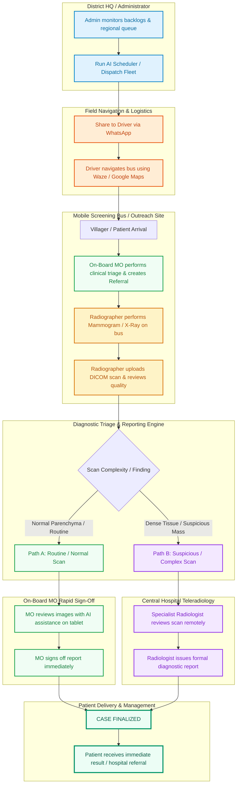
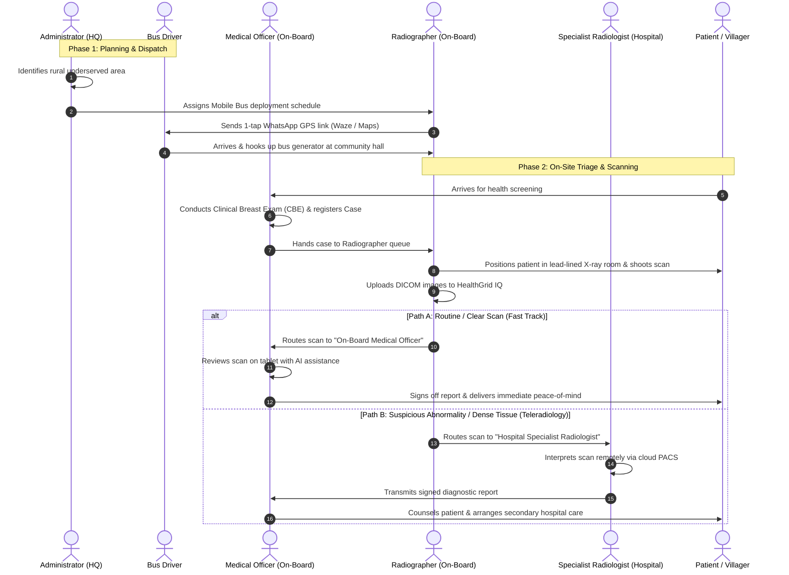
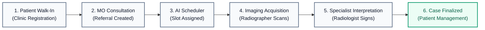
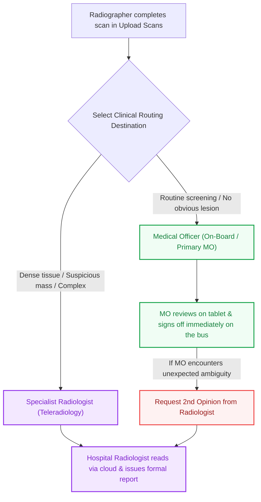

# HealthGrid IQ — Complete Clinical & Operational Workflow Guide

**Platform**: HealthGrid IQ — Clinical Imaging, Teleradiology & Mobile Outreach Platform  
**Target Audience**: Clinical Staff (MO, Radiographers, Radiologists), System Administrators, and Project Teams  
**Design Standard**: Human Clinical Healthcare Architecture  

---

## 1. Master System Flowchart



---

## 2. Mobile Screening Bus Outreach Workflow (Step-by-Step)



---

## 3. Static Healthcare Facility Workflow (Standard Hospital / Clinic)



---

## 4. Operational Roles & Responsibilities

| Role | Primary Location | Key Responsibilities |
| :--- | :--- | :--- |
| **System Administrator (Admin)** | Health District / HQ Office | Fleet dispatching, AI workload balancing, facility profile management, user credentials. |
| **Medical Officer (MO)** | Clinic / On-Board Bus | Patient triage, clinical breast examination (CBE), referral creation, on-board routine scan review and rapid sign-off. |
| **Radiographer (Juru X-Ray)** | Radiology Room / Bus Cabin | Field Equipment Lead. Conducts X-Ray/Mammogram scans, ensures DICOM image quality, uploads to cloud, coordinates bus travel. |
| **Specialist Radiologist (Pakar Radiologi)** | Hospital Reading Room (Remote) | Teleradiology specialist. Receives and interprets complex, abnormal, or dense tissue scans escalated from the field. |
| **Mobile Bus Driver** | Mobile Outreach Van | Heavy vehicle navigation, parking and generator hookup at rural sites. Receives 1-tap dispatch routes via WhatsApp. |

---

## 5. Diagnostic Routing Decision Matrix



---

## 6. GPS Dispatch & Turn-by-Turn Navigation

HealthGrid IQ includes zero-cost navigation utilities integrated across all mobile team views:

```
[ Assigned Clinic / Outreach Facility Banner ]
  ├── [ Navigate with Waze ]      -> Direct turn-by-turn navigation deep link.
  ├── [ Google Maps ]            -> Route overview and live traffic via Google Maps.
  └── [ Share to Driver ]         -> 1-tap WhatsApp dispatch pre-formatting destination,
                                     address, and both navigation links for the driver.
```

### Access Matrix by Role

| Screen / View | MO | Radiographer | Radiologist | Admin | Purpose |
| :--- | :---: | :---: | :---: | :---: | :--- |
| **Radiographer Dashboard** | — | Yes | — | — | Mobile van operator daily dispatch navigation & driver share. |
| **MO Department Dashboard** | Yes | — | — | — | Field doctor traveling to assigned clinic/community hall. |
| **Scan Queue** | — | Yes | — | — | Quick route check per patient appointment. |
| **Case Detail** | Yes | Yes | — | Yes | Reference destination coordinates for any case. |
| **Radiologist Dashboard** | — | — | — | — | *Hidden* (Radiologists work remotely in hospital reading rooms). |

---

## 7. Case Lifecycle Status Reference

| Status | Meaning | Triggered By | Next Step |
| :--- | :--- | :--- | :--- |
| `CREATED` | Referral created by MO or Reception. | Doctor creates new referral. | Admin runs AI Scheduler. |
| `SCHEDULED` | Time slot, centre, and radiographer assigned. | Admin confirms AI Scheduler. | Radiographer performs scan. |
| `SCANNED` | Imaging completed and DICOM files uploaded. | Radiographer submits scan. | MO or Radiologist review. |
| `FINALIZED` | Diagnostic report reviewed and signed off. | MO or Radiologist signs off. | Dossier printed / patient notified. |
