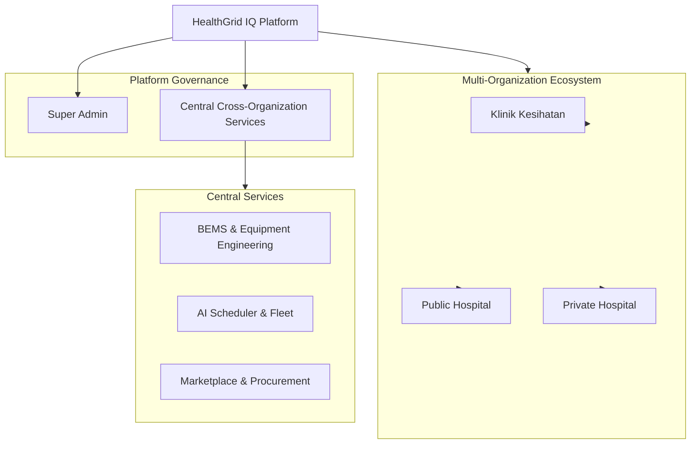
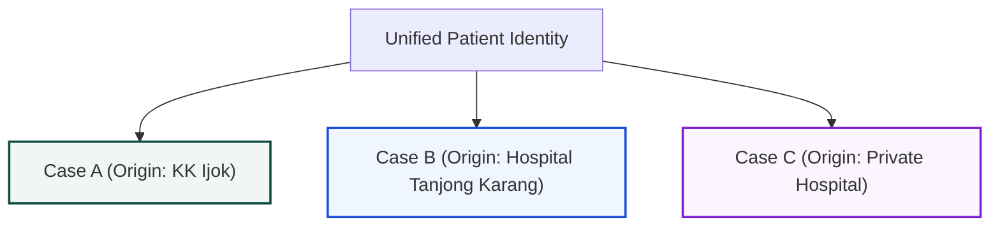
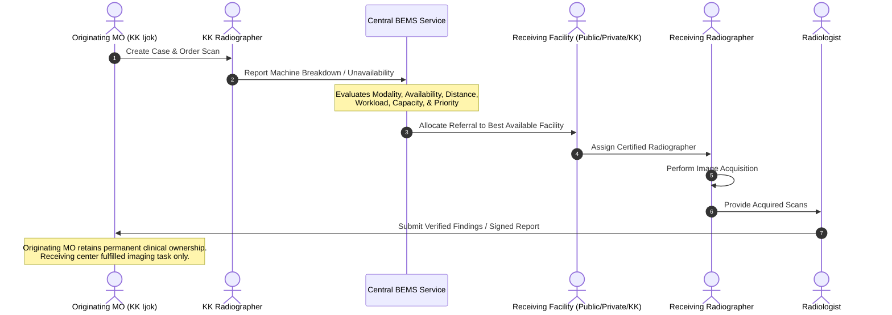
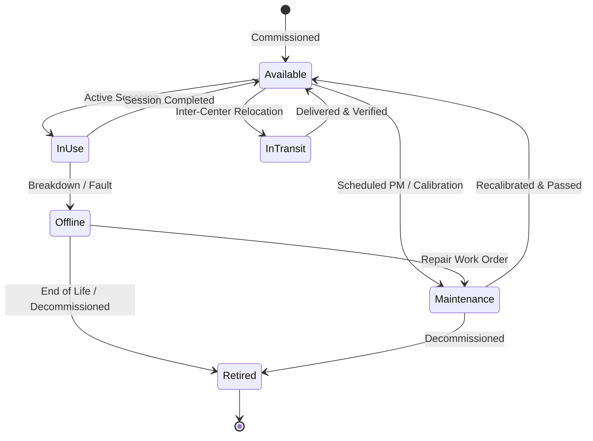
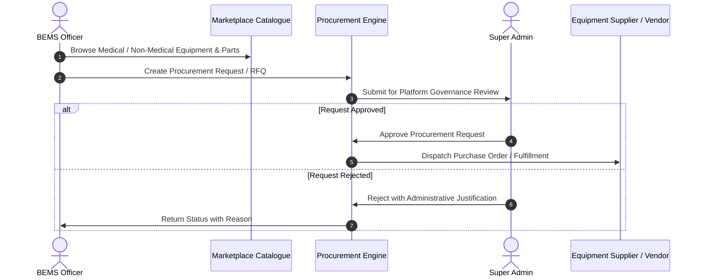

# HEALTHGRID IQ — Long-Term System Architecture & Domain Scope

> **MASTER SOURCE OF TRUTH**  
> *This document establishes the official long-term architectural foundation, domain boundary rules, and entity models for HealthGrid IQ. All future development, refactoring, feature additions, and schema extensions must strictly comply with this document.*

---

## 1. Core Vision

HealthGrid IQ is **ONE unified healthcare ecosystem**, not a fragmented collection of disparate systems.



### 1.1 Multi-Organization & Organization Isolation
The platform hosts multiple independent healthcare organizations under a single unified architecture. The architecture is **multi-organization and organization-isolated**, while enabling **controlled cross-organization workflows**.

Currently, there are **3 healthcare organization types**:
1. **Klinik Kesihatan (KK)** — Primary care and community health clinics.
2. **Public Hospital** — Ministry of Health (MOH) secondary and tertiary hospitals.
3. **Private Hospital** — Accredited private medical centers and imaging facilities.

### 1.2 Internal Healthcare Center Ecosystem
Each individual healthcare center (e.g., *KK Bestari Jaya*, *Hospital Tanjong Karang*, *KPJ Damansara*) operates its own internal ecosystem with dedicated:
- **Local Administrators**
- **Medical Officers (MO)**
- **Radiographers**
- **Radiologists** (where applicable)
- **Patients**
- **Cases & Clinical Orders**
- **Diagnostic Equipment**
- **Internal Workflows & Scheduling**

---

## 2. Super Admin (Platform-Level Governance)

**Super Admin** is the highest platform-level role within HealthGrid IQ.

```text
Super Admin (Platform Level)
 ├── Organization & Center Governance (KK, Public Hospitals, Private Hospitals)
 ├── Global User Directory & Multi-Role Access Control
 ├── Platform Infrastructure & Security Administration
 ├── Immutable Audit & System Compliance Oversight
 ├── Central BEMS Engineering & Machine Incident Oversight
 ├── Equipment Lifecycle & Relocation Management
 ├── Equipment Marketplace Governance
 └── Procurement Request Approvals & Quotation Finalization
```

- **Scope**: Super Admin does **not** belong to any single healthcare center. Super Admin oversees the entire HealthGrid IQ ecosystem across all organization types, facilities, and central services.

---

## 3. Domain Boundaries: Patients vs. Cases

The separation between **Patient Identity** and **Case Ownership** is a fundamental core rule of HealthGrid IQ.



### 3.1 Unified Patient Identity
- Patient identity is unified across the HealthGrid IQ platform.
- A patient registered at one healthcare center can be recognized across the ecosystem (e.g., via NRIC / Passport) to prevent redundant demographics creation.

### 3.2 Strict Case Ownership & Organization Isolation
- **Cases are owned strictly by their originating healthcare center.**
- A healthcare center **must NOT automatically see another healthcare center's cases** simply because the patient exists in the platform.
- Clinical case access is strictly restricted by **Organization ID**, **Healthcare Center ID**, and **User Role**.
- Medical history and cases remain private to the center managing the clinical episode unless explicitly referred.

---

## 4. Cross-Organization Cases & Exception Workflows

### 4.1 Normal Case Workflow (Internal)
Under standard operating conditions, all cases follow an entirely local pathway within the originating center:

```text
[Originating Center: KK Ijok]
   ↓
[Medical Officer Creates Case Order]
   ↓
[Local / Mobile Radiographer Performs Scan]
   ↓
[Radiologist Reports / MO Reviews]
   ↓
[Case Completed at Originating Center]
```

### 4.2 Cross-Organization Exception Workflow (via BEMS)
When an imaging machine breaks down, is offline, or lacks capacity at the originating center, the case transitions into a **controlled cross-organization workflow** coordinated by BEMS:



### 4.3 Core Rules for Cross-Organization Cases
1. **No Ownership Transfer**: The receiving healthcare center performs the requested imaging service but **does NOT permanently become the owner of the clinical case**.
2. **Result Custody**: Final diagnostic reports and acquired scans return directly to the **originating Medical Officer**.
3. **Audit Trail**: Every cross-organization dispatch, assignment, and status transition is recorded with immutable audit timestamps and user attribution.

---

## 5. Central BEMS (Biomedical Engineering Maintenance Services)

**BEMS is a central cross-organization service, NOT a healthcare organization type.**

```text
               Central BEMS Service
                        │
      ┌─────────────────┼─────────────────┐
      │                 │                 │
Klinik Kesihatan   Public Hospital   Private Hospital
```

### 5.1 BEMS Responsibilities
- Equipment incident ticketing and status triage.
- Maintenance, calibration, and repair coordination.
- Real-time equipment availability and uptime monitoring.
- Alternative facility and machine allocation for disrupted cases.
- Cross-center diagnostic imaging dispatch.
- Equipment movement, relocation, and loan management.
- Spare parts and machine procurement requests.

### 5.2 Intelligent Allocation & Routing Criteria
When allocating an external imaging referral, BEMS evaluates a multidimensional matrix:
1. **Required Imaging Modality** (X-Ray, CT, MRI, Ultrasound, Mammography, etc.)
2. **Machine Operational Status** (Operational, Calibrated, High Load, Down)
3. **Geographical Proximity & Travel Time** (Haversine/Driving distance from patient/origin)
4. **Healthcare Center Capacity & Operational Hours**
5. **Radiographer Availability & Active Shift Schedule**
6. **Current Radiographer Workload & Queue Length**
7. **Patient Urgency & Clinical Priority** (Routine, Urgent, Emergency)

> [!IMPORTANT]
> **Operational Capability Over Organization Type**  
> The routing goal of BEMS is **"Find the most suitable available healthcare facility capable of completing this task."**  
> Organization type (Public, Private, or KK) is secondary to clinical capability, operational availability, and proximity.

---

## 6. Equipment as a First-Class Independent Entity

Diagnostic equipment is treated as an **independent entity**, not merely an immutable attribute of a hospital building.



### 6.1 Equipment Statuses
- **Available** — Fully operational and ready for patient intake.
- **In Use** — Actively performing an imaging procedure.
- **In Transit** — Being relocated or transported between centers (or mobile PACS van deployment).
- **Maintenance** — Undergoing scheduled preventative maintenance, software update, or calibration.
- **Offline** — Inoperative due to fault, power failure, or breakdown.
- **Retired** — Decommissioned and archived.

### 6.2 Relocation & Cross-Center Utilization
Equipment units may be moved, loaned, shared, or temporarily assigned across healthcare centers based on operational demands or regional emergencies.

---

## 7. BEMS Marketplace & Procurement Workflow

HealthGrid IQ includes a commercial and institutional **Marketplace Catalogue** for medical diagnostic imaging systems, hospital support infrastructure, replacement parts, and consumables.



- **BEMS Role**: Identifies maintenance needs, browses catalogue, specifies technical requirements, and submits formal Procurement Requests.
- **Super Admin Role**: Reviews, evaluates budget/compliance, and officially approves or rejects procurement orders.

---

## 8. Future-Proofing & Extensibility Principles

1. **Extensible Organization Types**:  
   `Klinik Kesihatan`, `Public Hospital`, and `Private Hospital` are defined as configurable organization types. The system data model must allow new organization types to be introduced without requiring architectural refactoring.
2. **Strict Scope Discipline (No Speculative Overengineering)**:  
   **DO NOT** invent, code, or mock unconfirmed future organization types, actors, or speculative workflows until they are officially requested as requirements.
3. **Clean Abstractions**:  
   Keep core logic dependent on capabilities, permissions, and organization identifiers rather than hardcoded string logic.

---

## 9. Core Architectural Model & Entity Hierarchy

```text
                    HEALTHGRID IQ
                         │
                    SUPER ADMIN
                         │
        ┌────────────────┼────────────────┐
        │                │                │
Klinik Kesihatan   Public Hospital  Private Hospital
        │                │                │
        └────────────────┼────────────────┘
                         │
                    CENTRAL SERVICES
                         │
              ┌──────────┼──────────┐
              │          │          │
             BEMS    AI Scheduler  Marketplace &
                     & Van Fleet   Procurement
```

### 9.1 Core Domain Entity Relationships

| Entity | Scope | Description | Key Relationships |
| :--- | :--- | :--- | :--- |
| **Organization / Center** | Instance | An individual healthcare facility (KK, Hospital, Center). | Has many Users, Cases, Equipment, Shifts. |
| **User** | Center / Platform | Clinical, technical, or administrative staff member. | Belongs to Center (or Platform for Super Admin/BEMS). |
| **Role** | Permission | System role defining access boundaries and nav modules. | Mapped to User and Permissions. |
| **Patient** | Platform | Unified demographic and identity record. | Has many Cases across centers. |
| **Case** | Center | Clinical episode and diagnostic request. | Owned by originating Center; referenced in Referrals. |
| **Imaging Request** | Case | Specific scan modalities and protocols requested by MO. | Child of Case. |
| **External Referral** | Cross-Center | Task dispatched via BEMS to an external facility. | Links Case, Originating Center, Receiving Center. |
| **Equipment** | Global / Center | Physical diagnostic machine or mobile van unit. | Has Status, Maintenance Logs, Current Center. |
| **Workforce / Schedule** | Center | Shift rosters, radiographer capacity, and assignments. | Links User, Center, Modalities, Time Slots. |
| **BEMS Incident** | Cross-Center | Equipment breakdown or maintenance ticket. | Links Equipment, Center, BEMS Officer, Referrals. |
| **Procurement Request** | Platform | RFQ / Equipment order initiated by BEMS or Center. | Created by BEMS, Approved by Super Admin. |

---

## 10. Most Important Development Rule

> [!CAUTION]
> ### STRICT ARCHITECTURAL INTEGRITY RULE
> **Do NOT let future feature requests silently change this architecture.**
> 
> Before introducing any new actor, organization type, role, module, or cross-organization workflow:
> 1. Check `docs/HEALTHGRID_ARCHITECTURE.md`.
> 2. Determine where the requirement belongs in the existing hierarchy.
> 3. If a request conflicts with this architecture, **explicitly notify the user and discuss before changing code**.
> 4. Do not invent additional ecosystems or speculative abstractions.
> 5. Preserve **organization isolation** and **controlled cross-organization access** at all times.
