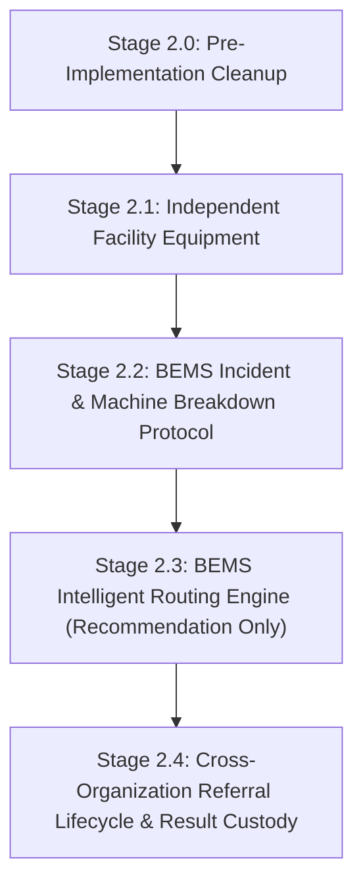

# HealthGrid IQ — Phase 2 Implementation Plan (Revised)

> **STATUS**: REVISED & PENDING FINAL APPROVAL  
> **Source of Truth**: [docs/HEALTHGRID_ARCHITECTURE.md](file:///c:/Users/Danesh%20Lou/Downloads/Rebuild/docs/HEALTHGRID_ARCHITECTURE.md)  
> **Prerequisite**: Phase 1 Foundation (Completed & Verified)

---

## 1. Executive Summary & Core Architectural Principles

Phase 2 builds directly on the verified Phase 1 Foundation (Multi-Organization & Healthcare Center Model, Functional Roles, Case Scoping) with the following core principles:

1. **Routing Engine = Recommendation Only**: The routing algorithm discovers eligible facilities and produces ranked suitability recommendations. It **never** dispatches cases automatically. The **BEMS Officer** remains the human operational decision-maker who reviews, approves, and initiates dispatch.
2. **Strict Separation of Equipment State and Clinical Case State**: An equipment breakdown transitions `FacilityEquipment.status = 'Offline'`, but does **not** corrupt the clinical `Case` status to a hardware state. The clinical case maintains its medical lifecycle, while the associated incident/referral entity flags that alternative imaging is required.
3. **First-Class `CrossOrganizationReferral` Entity**: Case-to-center relationships are governed by a dedicated `CrossOrganizationReferral` entity holding the full cross-center lifecycle, rather than relying on an ad-hoc field on `Case`.
4. **Preservation of POC Measurement Timestamps**: Standardized milestone timestamps are captured across the case and referral lifecycles to guarantee accurate future metrics for the HPU POC (Patient Waiting Time, Radiologist Turnaround Time, and KKM Capacity vs. Value).
5. **Imaging Department as an Operational Concept**: The POC scope includes the Imaging Department, Radiologist, Medical Officer, and Radiographer. `Imaging Department` is **not** a `UserRole`. Roles remain functional.

---

## 2. Stage Breakdown & Execution Plan



---

### Stage 2.0 — Pre-Implementation Architectural Cleanup

#### Objectives
1. **Fix Patient Case-Count Visibility Leak**:
   - In [src/pages/mo/PatientsList.tsx](file:///c:/Users/Danesh%20Lou/Downloads/Rebuild/src/pages/mo/PatientsList.tsx#L102-L104), replace global `cases` count with `scopedCases = getScopedCases()` so local clinic Medical Officers only see the count of cases originating from their own facility.
2. **Remove Legacy String-Based Filtering in Intake Dashboards**:
   - In [src/pages/external/PublicHospitalAdminDashboard.tsx](file:///c:/Users/Danesh%20Lou/Downloads/Rebuild/src/pages/external/PublicHospitalAdminDashboard.tsx) and [src/pages/external/PrivateHospitalAdminDashboard.tsx](file:///c:/Users/Danesh%20Lou/Downloads/Rebuild/src/pages/external/PrivateHospitalAdminDashboard.tsx), replace name/specialty string matching with strict `referral.receivingCenterId === currentUser.healthcareCenterId` and `user.healthcareCenterId === currentUser.healthcareCenterId`.
   - In [src/pages/bems/BemsDashboard.tsx](file:///c:/Users/Danesh%20Lou/Downloads/Rebuild/src/pages/bems/BemsDashboard.tsx), remove hardcoded name searches (e.g. `"noraini"`, `"clinic-002"`, or `"HKL"`).
3. **Harmonize Organization Identifiers**:
   - Standardize all references across cases and referrals to use `originatingCenterId`, `originatingCenterName`, `originatingOrganizationId`, `receivingCenterId`, `receivingCenterName`, and `receivingOrganizationId`.
4. **Constrain Radiologist Escalation Scoping**:
   - In [src/context/DataContext.tsx](file:///c:/Users/Danesh%20Lou/Downloads/Rebuild/src/context/DataContext.tsx#L90-L97), restrict escalated / second-opinion case visibility to radiologists whose `healthcareCenterId` matches the originating center OR who are explicitly assigned as `c.radiologistId === user.id` OR where the case was referred to their facility via active `CrossOrganizationReferral`.
5. **Resolve Equipment State Naming Collisions**:
   - In [DataContext.tsx](file:///c:/Users/Danesh%20Lou/Downloads/Rebuild/src/context/DataContext.tsx), rename the existing `equipment` state (which holds `MobilePacsVan[]`) to `mobilePacsVans`, reserving `facilityEquipment` for physical diagnostic equipment.

---

### Stage 2.1 — Independent Facility Equipment

#### Objectives
1. **Define First-Class `FacilityEquipment` Entity**:
   - Create `FacilityEquipment` in [src/types/index.ts](file:///c:/Users/Danesh%20Lou/Downloads/Rebuild/src/types/index.ts).
   - Independent operational statuses: `'Available' | 'In Use' | 'In Transit' | 'Maintenance' | 'Offline' | 'Retired'`.
   - Fields: `id`, `healthcareCenterId`, `healthcareCenterName`, `name`, `modality` (`ImagingModality`), `modelNumber`, `manufacturer`, `serialNumber`, `roomOrLocation`, `status`, `installationDate`, `lastMaintenanceDate`, `nextMaintenanceDue`, `operationalNotes`.
2. **Seed Realistic Facility Equipment Registry**:
   - In [src/services/mockData.ts](file:///c:/Users/Danesh%20Lou/Downloads/Rebuild/src/services/mockData.ts), generate physical equipment units mapped to:
     - `clinic-001` (KK Bestari Jaya): Fixed Digital X-Ray, Portable Ultrasound.
     - `clinic-002` (Hospital Tanjong Karang): Digital Radiography X-Ray, 64-Slice CT Scanner, 1.5T MRI Suite, Ultrasound Unit.
     - `clinic-003` (KK Ijok): Fixed Digital X-Ray System.
     - `clinic-004` (Hospital Kuala Lumpur): Multi-suite High-throughput CT, 3.0T MRI, Fluoroscopy, Digital Mammography, Static X-Ray.
     - `clinic-005` & `clinic-006` (Private Hospitals): Advanced Multi-slice CT, High-field MRI, Digital Mammography.
3. **Preserve Mobile PACS Logistics**:
   - Keep `MobilePacsVan` for vehicle tracking and scheduling without treating vans as the generic clinical equipment abstraction.
4. **State Management**:
   - Expose `facilityEquipment`, `addFacilityEquipment`, `updateFacilityEquipmentStatus`, and `getEquipmentForCenter(centerId)` in `DataContext`.

---

### Stage 2.2 — BEMS Incident & Machine Breakdown Protocol

#### Objectives
1. **Define Structured `BemsIncident` Entity**:
   - Create `BemsIncident` in [src/types/index.ts](file:///c:/Users/Danesh%20Lou/Downloads/Rebuild/src/types/index.ts).
   - Statuses: `'REPORTED' | 'TRIAGED' | 'WORK_ORDER_ISSUED' | 'IN_MAINTENANCE' | 'RESOLVED' | 'CLOSED'`.
   - Severities: `'Routine' | 'Urgent' | 'Critical Breakdown'`.
2. **Radiographer Breakdown Intake**:
   - In [src/pages/radiographer/RadiographerWorkspace.tsx](file:///c:/Users/Danesh%20Lou/Downloads/Rebuild/src/pages/radiographer/RadiographerWorkspace.tsx), upgrade breakdown modal:
     - Radiographer selects the specific failed local machine from `facilityEquipment`.
     - Selects issue reason (`Broken`, `Unavailable`, `Maintenance`, `Calibration`, `Detector Fault`, `Power Failure`) and provides clinical/operational context.
     - If triggered during an active case examination, links `associatedCaseId`.
3. **State Separation Enforcement**:
   - **Equipment**: Target `FacilityEquipment.status` transitions automatically to `'Offline'`.
   - **Incident**: A new `BemsIncident` ticket is logged and routed to BEMS queue.
   - **Case**: Clinical `Case` remains active; an associated `CrossOrganizationReferral` request is created in status `'REQUESTED'` indicating alternative imaging is required. The clinical `Case.status` does **not** change to a hardware state.

---

### Stage 2.3 — BEMS Intelligent Routing Engine (Recommendation Only)

#### Objectives
1. **Decision Support Architecture**:
   - Implement [src/services/routingService.ts](file:///c:/Users/Danesh%20Lou/Downloads/Rebuild/src/services/routingService.ts) to calculate suitability scores for candidate receiving healthcare centers.
2. **Operational Flow**:
   $$\text{Case Referral Request} \longrightarrow \text{Eligibility Filter} \longrightarrow \text{Multi-factor Scoring} \longrightarrow \text{Ranked Recommendations} \longrightarrow \mathbf{\text{BEMS Officer Review}} \longrightarrow \mathbf{\text{BEMS Approval}} \longrightarrow \text{Dispatch}$$
3. **Multi-Factor Scoring Matrix**:
   $$\text{Score} = w_m \cdot S_{\text{modality}} + w_e \cdot S_{\text{equipment}} + w_d \cdot S_{\text{distance}} + w_c \cdot S_{\text{capacity}} + w_r \cdot S_{\text{radiographer}} + w_u \cdot S_{\text{urgency}}$$
   - **Modality Match ($S_{\text{modality}}$)**: Strict filter ($1$ or excluded). Facility must support requested modality.
   - **Operational Machine ($S_{\text{equipment}}$)**: Evaluates `FacilityEquipment` status at candidate facility ($1$ if at least 1 machine is `'Available'`, $0.3$ if `'In Use'`, $0$ if all machines for modality are `'Offline'` / `'Maintenance'`).
   - **Haversine Distance ($S_{\text{distance}}$)**: Geographic proximity from originating center: $1 - \min(1, \frac{\text{dist\_km}}{50})$.
   - **Center Capacity / Caseload ($S_{\text{capacity}}$)**: $1 - \frac{\text{active\_cases}}{\text{maxDailyCapacity}}$.
   - **Radiographer Availability ($S_{\text{radiographer}}$)**: On-duty active/standby radiographers capable of modality.
   - **Urgency Multiplier ($S_{\text{urgency}}$)**: Distance and available machine weights scale up for `Emergency` cases.
4. **BEMS Interactive Recommendation Workspace**:
   - In [src/pages/bems/BemsDashboard.tsx](file:///c:/Users/Danesh%20Lou/Downloads/Rebuild/src/pages/bems/BemsDashboard.tsx), present ranked facility cards with transparent scoring breakdown (Distance, Active Machines, Wait Times, Staff On Duty, Overall Match %).
   - BEMS Officer may accept the top recommendation or select an alternative authorized facility with administrative rationale.

---

### Stage 2.4 — Cross-Organization Referral Lifecycle & Result Custody

#### Objectives
1. **Implement `CrossOrganizationReferral` Entity & State Machine**:
   - Complete referral lifecycle:
     ```text
     REQUESTED 
       ↓
     BEMS_REVIEW 
       ↓
     ALLOCATED 
       ↓
     DISPATCHED 
       ↓
     ACCEPTED (Receiving Facility Admin accepts)
       ↓
     RADIOGRAPHER_ASSIGNED (Receiving Radiographer assigned)
       ↓
     IMAGING_COMPLETED (Scans uploaded & exposure factors recorded)
       ↓
     RADIOLOGIST_REPORTING (Diagnostic evaluation in progress)
       ↓
     REPORT_SIGNED (Radiologist verifies & signs off)
       ↓
     RETURNED (Result delivered to originating MO)
       ↓
     CLOSED
     ```
2. **Receiving Facility Intake Workspace**:
   - Receiving Healthcare Center Admin (Klinik Kesihatan, Public Hospital, or Private Hospital depending on BEMS routing) reviews incoming referrals filtered strictly by `r.receivingCenterId === currentUser.healthcareCenterId`.
   - Admin officially accepts referral and assigns a certified local Radiographer.
3. **Receiving Radiographer Imaging Workflow**:
   - Assigned Radiographer views patient referral in workspace.
   - Performs imaging examination, records exposure parameters (kVp, mAs, radiation dose mSv per MOH PER.SS-RA301), and uploads DICOM scans.
   - Referral transitions to `IMAGING_COMPLETED`.
4. **Radiologist Reporting**:
   - Radiologist reviews DICOM/scans in [DiagnosticHub.tsx](file:///c:/Users/Danesh%20Lou/Downloads/Rebuild/src/pages/shared/DiagnosticHub.tsx), fills findings and impressions, and verifies/signs off.
   - Referral transitions to `REPORT_SIGNED`.
5. **Result Return & Permanent Ownership Invariant**:
   - Referral status transitions to `RETURNED`.
   - Originating Medical Officer (at originating clinic/center) receives immediate notification and accesses final report in [DepartmentDashboard.tsx](file:///c:/Users/Danesh%20Lou/Downloads/Rebuild/src/pages/mo/DepartmentDashboard.tsx).
   - **Core Invariant Verified**: Case ownership never transfers to the receiving facility; the receiving center acts as an outsourced imaging service provider only.

---

## 3. Exact Data Model Changes

### 3.1 New Core Interfaces in [src/types/index.ts](file:///c:/Users/Danesh%20Lou/Downloads/Rebuild/src/types/index.ts)

```typescript
// ── Operational Modalities ─────────────────────────────────────────────────
export type ImagingModality = 
  | 'X-Ray' 
  | 'CT' 
  | 'MRI' 
  | 'Ultrasound' 
  | 'Mammography' 
  | 'Fluoroscopy' 
  | 'PET-CT'
  | 'Mobile PACS';

// ── Facility Equipment Entity ──────────────────────────────────────────────
export type EquipmentOperationalStatus = 
  | 'Available' 
  | 'In Use' 
  | 'In Transit' 
  | 'Maintenance' 
  | 'Offline' 
  | 'Retired';

export interface FacilityEquipment {
  id: string; // e.g. "eq-kk-ijok-xray-01", "eq-htk-ct-01"
  healthcareCenterId: string; // Source of truth for facility location
  healthcareCenterName: string;
  name: string; // e.g. "Siemens Multix Impact Digital X-Ray"
  modality: ImagingModality;
  modelNumber: string;
  manufacturer: string;
  serialNumber: string;
  roomOrLocation: string; // e.g. "Bilik X-Ray 1", "CT Suite 1"
  status: EquipmentOperationalStatus;
  installationDate?: string;
  lastMaintenanceDate?: string;
  nextMaintenanceDue?: string;
  currentIncidentId?: string;
  operationalNotes?: string;
}

// ── BEMS Incident Entity ───────────────────────────────────────────────────
export type BemsIncidentStatus = 
  | 'REPORTED' 
  | 'TRIAGED' 
  | 'WORK_ORDER_ISSUED' 
  | 'IN_MAINTENANCE' 
  | 'RESOLVED' 
  | 'CLOSED';

export type BemsIncidentSeverity = 'Routine' | 'Urgent' | 'Critical Breakdown';

export interface BemsIncident {
  id: string; // e.g. "inc-2026-001"
  incidentNumber: string; // e.g. "INC-20260821-01"
  equipmentId: string; // Links to FacilityEquipment.id
  equipmentName: string;
  modality: ImagingModality;
  healthcareCenterId: string; // Originating facility of broken machine
  healthcareCenterName: string;
  reportedByUserId: string;
  reportedByUserName: string;
  reportedByUserRole: UserRole;
  issueReason: MachineIssueReason;
  issueDetails: string;
  severity: BemsIncidentSeverity;
  status: BemsIncidentStatus;
  associatedCaseId?: string; // Case impacted if breakdown occurred during exam
  bemsOfficerId?: string;
  bemsOfficerName?: string;
  workOrderNumber?: string;
  createdAt: string;
  updatedAt: string;
  resolvedAt?: string;
  resolutionNotes?: string;
}

// ── First-Class Cross-Organization Referral Entity ─────────────────────────
export type CrossOrgReferralStatus = 
  | 'REQUESTED'
  | 'BEMS_REVIEW'
  | 'ALLOCATED'
  | 'DISPATCHED'
  | 'ACCEPTED'
  | 'RADIOGRAPHER_ASSIGNED'
  | 'IMAGING_COMPLETED'
  | 'RADIOLOGIST_REPORTING'
  | 'REPORT_SIGNED'
  | 'RETURNED'
  | 'CLOSED'
  | 'REJECTED'
  | 'CANCELLED';

export interface CrossOrganizationReferral {
  id: string; // e.g. "ref-2026-001"
  referralNumber: string; // e.g. "REF-20260821-001"
  caseId: string;
  caseNumber: string;
  patientId: string;
  patientName: string;
  modality: ImagingModality;
  urgency: 'Routine' | 'Urgent' | 'Emergency';
  
  // Originating Entity (Clinical Owner)
  originatingCenterId: string;
  originatingCenterName: string;
  originatingOrganizationId?: string;
  requestedByUserId: string;
  requestedByUserName: string;
  requestedByUserRole: UserRole;
  referralReason: string;
  incidentId?: string; // If triggered by equipment breakdown

  // Receiving Entity (Service Provider)
  receivingCenterId?: string;
  receivingCenterName?: string;
  receivingOrganizationId?: string;
  receivingFacilityType?: HealthcareOrganizationType;

  // BEMS Governance
  bemsOfficerId?: string;
  bemsOfficerName?: string;
  bemsAllocationNotes?: string;

  // Receiving Facility Actors
  receivingAdminId?: string;
  receivingAdminName?: string;
  assignedRadiographerId?: string;
  assignedRadiographerName?: string;
  assignedRadiologistId?: string;
  assignedRadiologistName?: string;

  // Clinical & Workflow Artifacts
  uploadedImageKeys?: string[];
  reportId?: string;
  status: CrossOrgReferralStatus;
  rejectionReason?: string;

  // POC Measurement Milestones (ISO 8601 Timestamps)
  timestamps: {
    requestedAt: string;
    bemsAllocatedAt?: string;
    dispatchedAt?: string;
    acceptedAt?: string;
    radiographerAssignedAt?: string;
    imagingStartedAt?: string;
    imagingCompletedAt?: string;
    radiologistAssignedAt?: string;
    reportStartedAt?: string;
    reportSignedAt?: string;
    returnedToOriginAt?: string;
    closedAt?: string;
  };
}

// ── Routing Recommendation (Decision Support) ──────────────────────────────
export interface RoutingRecommendation {
  facilityId: string;
  facilityName: string;
  organizationType: HealthcareOrganizationType;
  distanceKm: number;
  estimatedDriveMinutes: number;
  availableEquipmentCount: number;
  equipmentNames: string[];
  activeCaseload: number;
  maxDailyCapacity: number;
  capacityUtilizationPercent: number;
  availableRadiographersCount: number;
  radiographerNames: string[];
  suitabilityScore: number; // 0 to 100
  scoreBreakdown: {
    modalityMatch: boolean;
    equipmentScore: number;
    distanceScore: number;
    capacityScore: number;
    staffScore: number;
  };
  recommendationReason: string;
}
```

### 3.2 Updates to [Case](file:///c:/Users/Danesh%20Lou/Downloads/Rebuild/src/types/index.ts#L196-L393)

```typescript
export interface Case {
  // ... existing clinical fields ...
  
  /** Current active cross-organization referral if routed via BEMS */
  externalReferralId?: string;
  /** Linked equipment unit used for scanning */
  equipmentId?: string;
  /** Linked BEMS incident if machine breakdown occurred */
  incidentId?: string;

  // POC Measurement Milestones (Preserved for HPU KPI Calculations)
  lifecycleTimestamps?: {
    caseCreatedAt: string;
    scheduledAt?: string;
    patientArrivedAt?: string;
    scanStartedAt?: string;
    scanCompletedAt?: string;
    radiologistReviewStartedAt?: string;
    reportSignedAt?: string;
    moReviewCompletedAt?: string;
  };
}
```

---

## 4. Affected Files Matrix

| File Path | Stage | Primary Modifications |
| :--- | :--- | :--- |
| `src/types/index.ts` | 2.0–2.4 | Add `ImagingModality`, `EquipmentOperationalStatus`, `FacilityEquipment`, `BemsIncident`, `CrossOrganizationReferral`, `RoutingRecommendation`. Update `Case`. |
| `src/services/mockData.ts` | 2.1–2.4 | Seed `mockFacilityEquipment`, `mockBemsIncidents`, and `mockCrossOrgReferrals` mapped to `clinic-001` through `clinic-006`. |
| `src/services/dataService.ts` | 2.1–2.4 | Export getters for facility equipment, incidents, and cross-organization referrals. |
| `src/services/routingService.ts` | 2.3 | **[NEW]** Algorithmic routing decision support engine (recommendations only). |
| `src/context/DataContext.tsx` | 2.0–2.4 | Rename `equipment` to `mobilePacsVans`, add `facilityEquipment`, `bemsIncidents`, and `crossOrgReferrals` states; update `getScopedCasesForUser` to evaluate active referrals; bump storage version to `15`. |
| `src/pages/mo/PatientsList.tsx` | 2.0 | Fix case count calculation using `scopedCases`. |
| `src/pages/radiographer/RadiographerWorkspace.tsx` | 2.2 | Upgrade breakdown modal to pick local `FacilityEquipment` and dispatch `BemsIncident` without altering clinical case state. |
| `src/pages/bems/BemsDashboard.tsx` | 2.0, 2.2, 2.3, 2.4 | Render ranked routing recommendations, enable BEMS manual approval/dispatch, and manage incident board. |
| `src/pages/external/PublicHospitalAdminDashboard.tsx` | 2.0, 2.4 | Update intake to consume `CrossOrganizationReferral` scoped strictly to `receivingCenterId`. |
| `src/pages/external/PrivateHospitalAdminDashboard.tsx` | 2.0, 2.4 | Update intake to consume `CrossOrganizationReferral` scoped strictly to `receivingCenterId`. |
| `src/pages/external/ExternalRadiographerWorkspace.tsx` | 2.4 | Implement scan upload & exposure parameters linked to `CrossOrganizationReferral`. |
| `src/pages/shared/DiagnosticHub.tsx` | 2.4 | Radiologist reporting linked to referral completion. |
| `src/pages/mo/DepartmentDashboard.tsx` | 2.4 | MO review and custody confirmation of returned referral reports. |
| `src/pages/admin/FleetManagement.tsx` | 2.1 | Update references from `equipment` to `mobilePacsVans`. |

---

## 5. Migration & State Management Considerations

1. **LocalStorage Cache Busting**:
   - `STORAGE_VERSION` in [DataContext.tsx](file:///c:/Users/Danesh%20Lou/Downloads/Rebuild/src/context/DataContext.tsx#L44) will be incremented from `'14'` to `'15'`.
   - On load, stale schemas will be cleanly discarded and replaced with normalized seed data.
2. **Backward Compatibility**:
   - Transitional aliases (`ExternalImagingRequest`, `mockDemoCases`, `clinics`) will remain accessible to avoid breaking any legacy views.

---

## 6. Dependencies Between Stages

- **Stage 2.0 (Cleanup)** is self-contained and executed first.
- **Stage 2.1 (Equipment Model)** is a strict prerequisite for **Stage 2.2 (Incidents)** and **Stage 2.3 (Routing)**.
- **Stage 2.3 (Routing Engine)** feeds recommendations into **Stage 2.4 (Referrals)**.
- **Stage 2.4 (Referrals)** closes the complete cross-organization workflow.

---

## 7. Verification & Test Plan

### Automated Build Verification
- `npm run build` (`tsc -b && vite build`) must pass with code `0` after each stage.

### Multi-Tenant Scenario Tests
1. **Scenario 1: Equipment Breakdown & Status Flip**:
   - Radiographer at KK Ijok (`rad-002`) reports breakdown for Digital X-Ray machine `eq-kk-ijok-xray-01`.
   - Verify `FacilityEquipment.status` becomes `'Offline'`.
   - Verify `BemsIncident` is created in status `'REPORTED'`.
   - Verify clinical `Case` remains in clinical status while a linked `CrossOrganizationReferral` in status `'REQUESTED'` is spawned.
2. **Scenario 2: Intelligent Routing (Recommendation Only)**:
   - BEMS Officer (`bemz-001`) reviews referral in BEMS Dashboard.
   - Routing engine calculates and displays ranked options (Hospital Tanjong Karang and KK Bestari Jaya at top; offline centers scored lowest).
   - Verify no automated dispatch occurs until BEMS Officer clicks "Approve & Dispatch".
3. **Scenario 3: Cross-Organization Referral Lifecycle & Result Custody**:
   - BEMS dispatches referral to Hospital Tanjong Karang (`clinic-002`).
   - Public Hospital Admin (`pub-admin-001`) at Tanjong Karang accepts referral and assigns Noraini Harun (`pub-rad-001`).
   - Noraini uploads scans $\rightarrow$ Radiologist signs report.
   - Verify referral transitions to `'RETURNED'`.
   - Originating MO (Dr. Faizah at KK Ijok) views signed report and completes clinical episode.
   - Verify Dr. Michelle (KK Bestari Jaya) cannot see the KK Ijok referral or case at any time.
4. **Scenario 4: POC Measurement Timestamps**:
   - Verify all milestone timestamps (`requestedAt`, `bemsAllocatedAt`, `acceptedAt`, `imagingCompletedAt`, `reportSignedAt`, `returnedToOriginAt`) are populated in `CrossOrganizationReferral.timestamps`.

---

## 8. What Will Explicitly NOT Be Changed

Phase 2 will **NOT**:
1. Create `Imaging Department` as a `UserRole`.
2. Introduce automated autonomous dispatch without BEMS Officer approval.
3. Build new KPI analytics charts or statistical dashboard components (milestone timestamps are captured in the data model only).
4. Add billing, payment gateways, or e-commerce features to the Marketplace.
5. Create unconfirmed speculative organization types or modify Mobile PACS fleet tracking.

---

*Revised Phase 2 Implementation Plan complete. Awaiting your approval before beginning implementation.*
